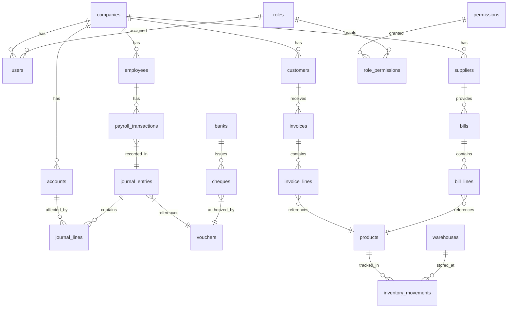
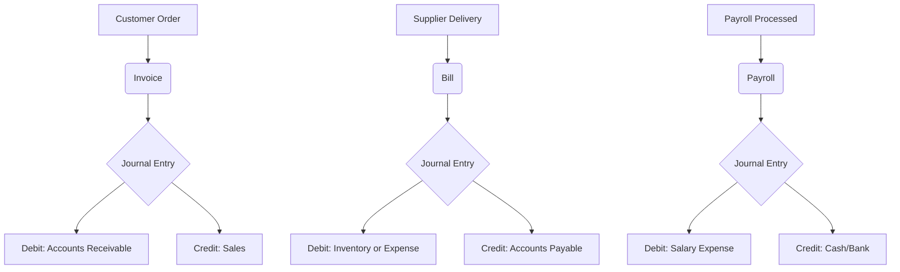

# 📘 Accounting System - Entity Relationship Diagram (ERD)

This document provides a complete ERD representation for the accounting software, including database structure, relationships, and visual flows.

---

## 🔗 Entity Relationships



---

## 🧱 Table Highlights

### 1. Core Entities

- **companies**: Stores organization metadata.
- **users**: System users with roles.
- **roles & permissions**: Role-based access control.

### 2. Accounting Foundation

- **accounts**: Chart of accounts structure.
- **journal_entries**: Financial transactions.
- **journal_lines**: Line-item details of journal entries.

### 3. Tax Management

- **tax_codes**: Tax definitions (rate, type, account link).

### 4. Sales & Receivables

- **customers**: Clients for invoicing.
- **invoices** & **invoice_lines**: Sales billing and line items.

### 5. Purchases & Payables

- **suppliers**: Vendor profiles.
- **bills** & **bill_lines**: Purchase recording.

### 6. Banking & Payments

- **banks**: Bank info with currency and branch.
- **payments** & **cheques**: Transaction and cheque tracking.

### 7. Vouchers

- **vouchers** & **voucher_lines**: Central financial document controller.

### 8. Inventory

- **products**: SKU-based items.
- **warehouses**: Physical storage.
- **inventory_movements**: Transaction logs.

### 9. Payroll & HR

- **employees**, **departments**, **payroll_transactions**.

### 10. Audit & Compliance

- **audit_logs**: Tracks user actions.
- **bank_reconciliation**: Monthly closing checks.

---

## 🔄 Money Flow Examples

### 💰 Sales Transaction
```text
Customer → Invoice → Journal Entry
  - Debit: Accounts Receivable
  - Credit: Sales Revenue
```

### 🧾 Purchase Transaction
```text
Supplier → Bill → Journal Entry
  - Debit: Inventory or Expense
  - Credit: Accounts Payable
```

### 👥 Payroll Transaction
```text
Employee → Payroll → Journal Entry
  - Debit: Salary Expense
  - Credit: Bank / Cash
```

---

## 🔁 Visual Cheatsheet



---

> Generated with ❤️ for system clarity and modular scalability.
